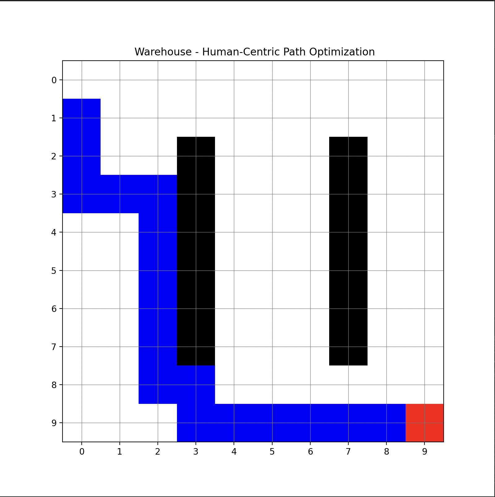

# Human-Centric Warehouse Route Optimizer 🚚💨

An algorithmic simulation engine built to optimize order-picking routes for industrial warehouse handlers by balancing physical distance against human-centric constraints like fatigue, aisle congestion, and cargo weight. 



---

## 🚀 The Core Engineering Problem

Standard warehouse routing models treat agents like robots—assuming uniform speed and zero friction. In reality, human logistics performance fluctuates dynamically based on environmental and physical stressors. This system transitions pathfinding from a simple "Shortest Geometric Distance" calculation to a **"Minimum Human Effort"** paradigm.

### Implemented Dynamic Constraints:
1. **Dynamic Congestion:** Aisle cells near high-traffic components (e.g., central conveyor belts or sorting zones) dynamically increase traversal cost, forcing the engine to calculate a path around bottlenecks.
2. **Physiological Fatigue:** As a handler's path history ($g$-cost) scales, an incremental tracking multiplier simulates muscle fatigue, prioritizing low-friction paths over prolonged, strenuous exploration.
3. **Cargo Density Weighting:** Modifies step costs based on package weight properties, automatically rerouting simulated agents to wider, low-resistance pathways when moving heavy freight.

---

## 🛠️ Architecture & Data Structures

This project leverages a decoupled, cross-language pipeline designed for maximum performance at the computing layer and rapid rendering at the presentation layer.

| Component | Technology | Core Data Structure / Algorithm | Technical Justification |
| :--- | :--- | :--- | :--- |
| **Routing Brain** | C++20 | **Weighted A\* Search** | Evaluates spatial vectors natively with zero garbage-collection latency. |
| **Open List** | C++ STL | **Binary Min-Heap (`std::priority_queue`)** | Optimizes next-step node extraction to $O(\log N)$ complexity. |
| **Lookback Map** | C++ Pointers | **In-Memory Graph Backtracking** | Uses node pointer linkages to re-trace optimal steps back to root without searching. |
| **Pipeline Bridge** | CSV Serialization | **I/O File Streams (`std::ofstream`)** | Minimizes IPC runtime footprint. |
| **Visual Dashboard** | Python 3 | `NumPy` & `Matplotlib` | Transforms structural arrays into discrete matrix color heatmaps. |

---

## 📊 Performance & Complexity Analysis

* **Time Complexity:** $O(E \log V)$ where $E$ represents explored valid cell boundaries and $V$ represents the structural queue size. Using a custom comparator functor (`CompareNodes`) to process pointer elements in the min-heap ensures efficient element ordering.
* **Space Complexity:** $O(R \times C)$ matrix space mapping where $R$ and $C$ equal grid constants. State matrices are optimized to use static allocations, minimizing runtime overhead.

---

## 🎛️ Setup and Execution

### Prerequisites
* A C++ compiler supporting standard `C++17` or `C++20` (Built and verified via CLion)
* Python 3.x with `numpy` and `matplotlib` dependencies installed

### Execution Pipeline

1. **Compile and run the C++ routing backbone:**
   ```bash
   g++ -std=c++20 main.cpp -o engine
   ./engine
